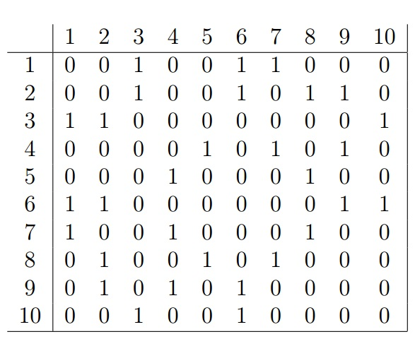
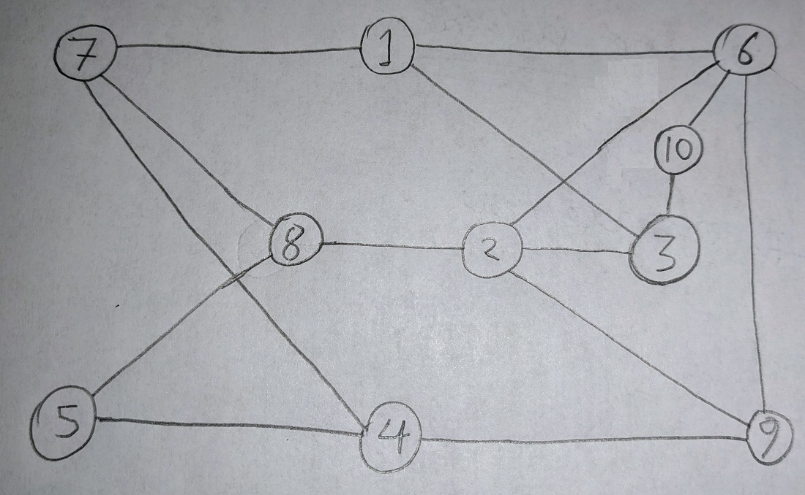
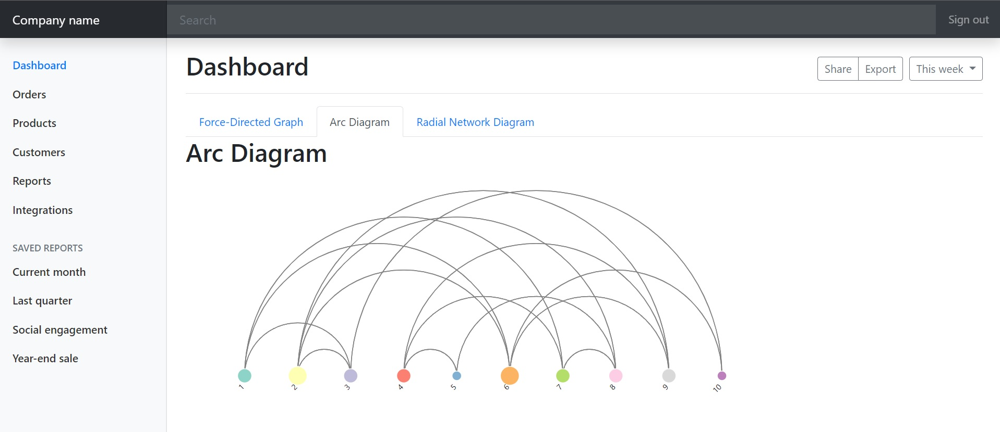
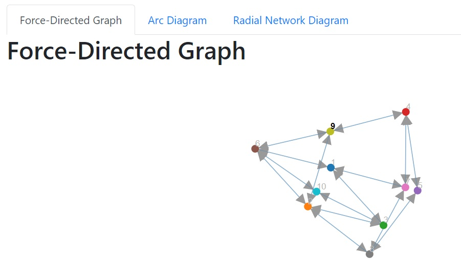
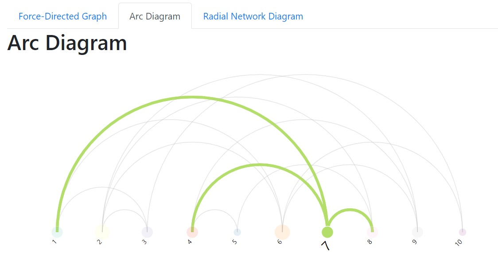
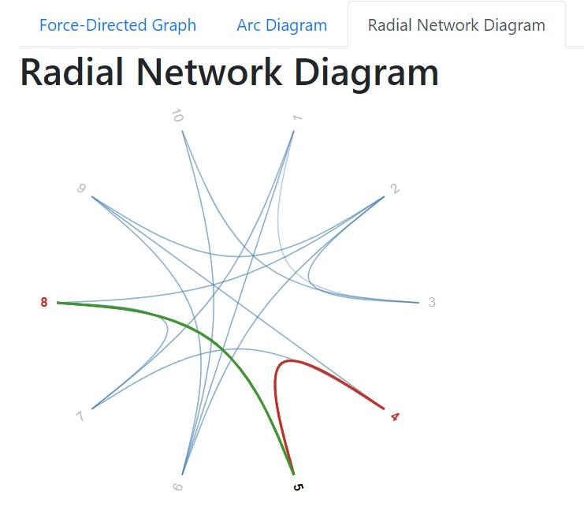

# D3js v4 - Graph Visualization

All work tasklist can be found in [here](./Project%202.pdf) and code can be found in [here](./code).

The adjacency matrix is looking like this-

Hand drawn graph from the adjacency matrix is like this-

The dashboard is looking like this-

## Dasbboard

where different components can be switched from tab and every component is interactable. The 3 components are-

### 1. Force Directed Graph

I am doing it as a directed graph with a direction from source to destination.

And the graph is self adjustable and interactable. The node names are also hoverable like this-

### 2. Arc Diagram Graph

The arcs are hoverable and interactable like this-

### 3. Radial Network Diagram Gaph

And after hovering any item, the graph is looking like this-

